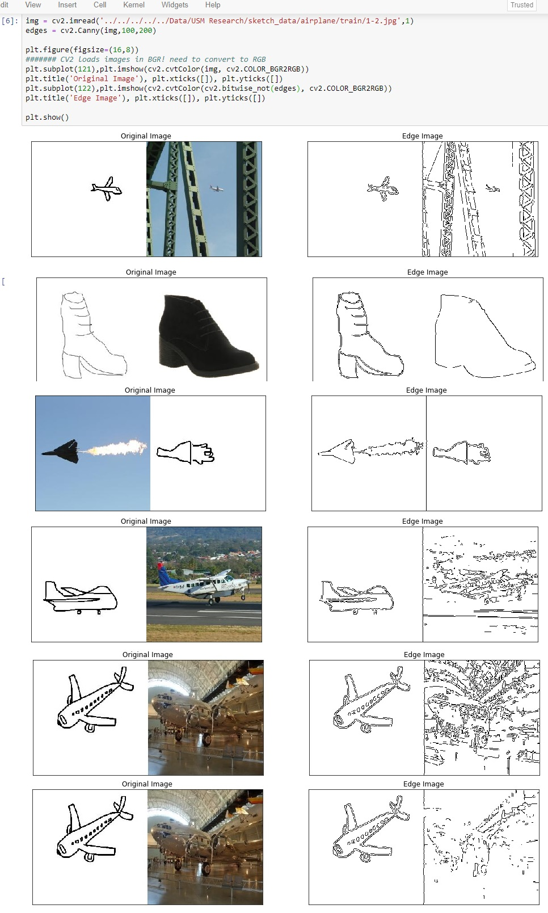

# Image-to-Scene Sketch Translation

## Table of Contents
- [About](#about)
- [Setup](#setup)
- [Authors](#authors)

***
## About

### Publication

https://ieeexplore.ieee.org/document/9288276

### Description 

Image generation from sketch is a popular and well-studied computer vision problem. However, the inverse problem image-to-sketch (I2S) synthesis still remains open and challenging, let alone image-to-scene sketch (I2S 2 ) synthesis, especially when full-scene sketch generations are highly desired.  This research investigates  a framework for generating full-scene sketch representations from natural scene images, aiming to generate outputs that approximate hand-drawn scene sketches.  

### Implementation

The base architecture for this project is [a pytorch implementation of CycleGAN](https://github.com/junyanz/CycleGAN). 

Exploratory work includes:
- Designed Canny edge detection pytorch module for additional input
- Implemented Holistically-Nested Edge Detection architecture for additional input
- Implemented Wasserstein loss metric as alternative to least squares and cross entropy
- Experimented with learning rate decay and other scheduling  

Canny Edge Detection:

### Works referenced in this project

**CycleGAN: [Project](https://junyanz.github.io/CycleGAN/) |  [Paper](https://arxiv.org/pdf/1703.10593.pdf) |  [Torch](https://github.com/junyanz/CycleGAN)**

**Pix2pix:  [Project](https://phillipi.github.io/pix2pix/) |  [Paper](https://arxiv.org/pdf/1611.07004.pdf) |  [Torch](https://github.com/phillipi/pix2pix)**

**HED:  [Project](https://github.com/s9xie/hed) |  [Paper](https://arxiv.org/pdf/1504.06375.pdf) |  [Torch](https://github.com/s9xie/hed)**

[Back to Top](#table-of-contents)

## Setup

### Required modules for training/inference

- PyTorch 0.41+

### Required modules for scripts

- opencv-python

### Anaconda environment

See [environment.yml](environment.yml)

[Back to Top](#table-of-contents)

## Authors
***
* **Dan McGonigle** [dpmcgonigle](https://github.com/dpmcgonigle)

[Back to Top](#table-of-contents)