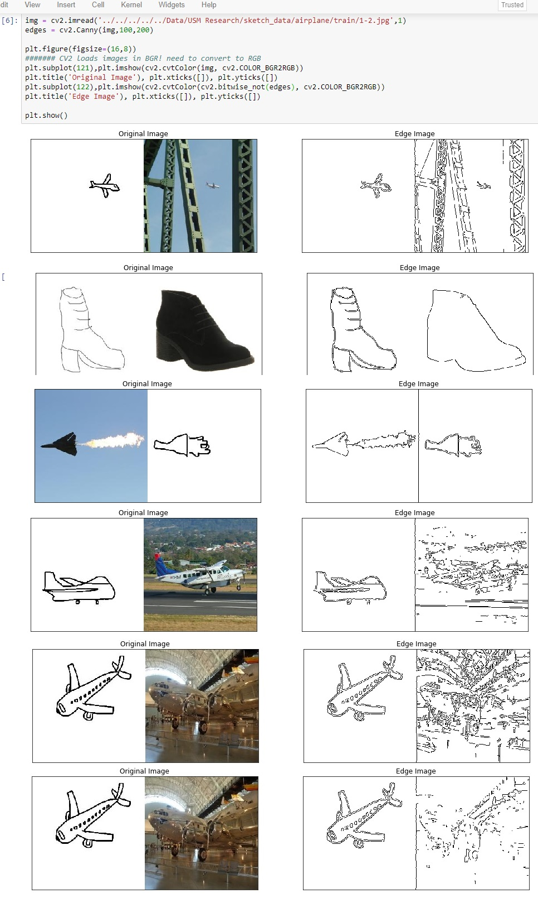

# CycleGAN and pix2pix in PyTorch

This suite will be the testing area for generating sketch images for the sketchgan project, Dr. Li.
Original code was written by [Jun-Yan Zhu](https://github.com/junyanz) and [Taesung Park](https://github.com/taesung), and supported by [Tongzhou Wang](https://ssnl.github.io/).
I have adapted it to try and make an agreeable environment to test new ideas, loss metrics, etc.

## Changes

See McNotes.txt for changes.  Some of the major changes:
<ul>
<li> Stripped visdom from project
<li> Adjusted most of the command-line option defaults, deleted some related to visdom and html generation, and added some
<li> Added Canny edge detection functionality
<li> Added save_sample() functionality to save a set of fake/real images (for one picture) periodically
</ul>

Also see TrainFlow.txt for a brief flowchart of the functions being called in this suite.  I've tried to trim the fat and keep only what is needed, but it is slightly hard to follow the different functionalities as this suite has been designed in a highly object-oriented fashion.

## Canny Edge Detection

I believe that it may prove beneficial to try and map from Canny edge detection map of input to sketch target.  There are definitely some challenges with images that have complicated backgrounds that stand out:

**Note**: The current software works well with PyTorch 0.41+. 

**CycleGAN: [Project](https://junyanz.github.io/CycleGAN/) |  [Paper](https://arxiv.org/pdf/1703.10593.pdf) |  [Torch](https://github.com/junyanz/CycleGAN)**

**Pix2pix:  [Project](https://phillipi.github.io/pix2pix/) |  [Paper](https://arxiv.org/pdf/1611.07004.pdf) |  [Torch](https://github.com/phillipi/pix2pix)**

## Prerequisites
- Runs in Linux, Windows or MacOS
- Python 3
- CPU or NVIDIA GPU + CUDA CuDNN

